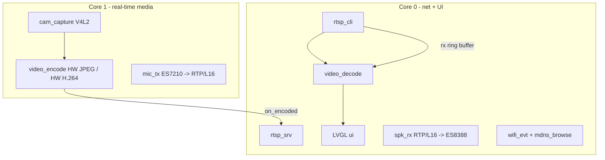

# M5Tab5-VideoLink architecture

A symmetric, two-way audio/video intercom between two M5Stack Tab5 (ESP32-P4)
tablets. Each unit simultaneously **publishes** its own camera+mic and
**subscribes** to the peer's, so both screens show the other side at once.

## Hardware

- **ESP32-P4** main SoC: dual-core RISC-V @ 360 MHz, 32 MB PSRAM, 16 MB flash.
  Hardware JPEG codec (encode + decode), hardware H.264 **encoder**, MIPI-CSI,
  MIPI-DSI, PPA, ISP.
- **ESP32-C6** co-processor: provides WiFi over SDIO via ESP-Hosted.
- **SC202CS** MIPI-CSI camera (detected PID 0xeb52); **1280x720** MIPI-DSI
  display (ILI9881C or ST7123 depending on hardware revision); **ES8388**
  speaker codec + **ES7210** mic front-end.

## Software stack

Built with **PlatformIO** + **ESP-IDF v5.5.4** (via the pioarduino `espressif32`
platform). Key components (pulled by the IDF component manager, see
[`src/idf_component.yml`](../src/idf_component.yml)):

- `espressif/m5stack_tab5` BSP — display, touch, audio (`esp_codec_dev`), camera.
- `espressif/esp_video` — V4L2 camera capture + codec devices.
- `esp_driver_jpeg` (IDF) — hardware JPEG encode/decode.
- `espressif/esp_h264` — hardware H.264 encode, tinyh264 software decode.
- `espressif/esp_hosted` + `espressif/esp_wifi_remote` — WiFi via the C6.
- `espressif/mdns` — Bonjour/mDNS discovery.
- `lvgl` + `espressif/esp_lvgl_port` — UI.

## Dual-core task model

Tasks are explicitly pinned so the capture/encode/send and receive/decode/render
pipelines run in parallel.



- Core 1: `cam_enc` (capture + encode) and `mic_tx` (audio capture/send).
- Core 0: `rtsp_srv`, `rtsp_cli`, `vdec` (decode), `spk_rx` (audio playback),
  LVGL, WiFi events and `mdns_browse`.
- Cross-core handoff uses FreeRTOS queues with a latest-frame-wins drop policy
  to bound latency. The single JPEG hardware engine (encode **or** decode at a
  time) is serialized with a mutex shared by the MJPEG encoder/decoder.

## Codec abstraction (hybrid)

[`media/video_codec.h`](../src/media/video_codec.h) defines `VideoEncoder` /
`VideoDecoder` with two backends, chosen at runtime and advertised over the
link:

- **MJPEG** ([`video_codec_mjpeg.cpp`](../src/media/video_codec_mjpeg.cpp)) —
  hardware encode **and** decode. Default and always-available fallback.
  Higher bitrate (~3-5 Mbps/stream) but trivial CPU on both ends.
- **H.264** ([`video_codec_h264.cpp`](../src/media/video_codec_h264.cpp)) —
  hardware encode + tinyh264 software decode. ~4-8x lower bitrate. Software
  decode is feasible at 640x360 (extrapolated ~30-40 fps from Espressif's
  720p@10fps figure) but **must be validated on hardware**. Marked experimental.

The factory in `video_codec_mjpeg.cpp` automatically falls back to MJPEG if the
H.264 backend is unavailable.

## Transport (standards-based)

- **Video**: RTSP (RFC 2326) controls the session; media is RTP/UDP (RFC 3550).
  - MJPEG payload per **RFC 2435** ([`rtsp/rtp.cpp`](../src/rtsp/rtp.cpp)): the
    sender strips the hardware JPEG to scan data + quant tables; the receiver
    reconstructs a baseline JPEG (standard Huffman tables) for the HW decoder.
  - H.264 payload per **RFC 6184**: single-NAL + FU-A fragmentation.
  - Each device runs both an RTSP **server** (publishing its camera) and a
    **client** (pulling the peer), so the link is symmetric. A single Tab5
    stream is also viewable in VLC/ffmpeg (MJPEG).
- **Audio**: RTP/L16 (16-bit linear PCM, RFC 3551), 16 kHz mono, on a dedicated
  UDP port ([`media/audio.cpp`](../src/media/audio.cpp)). Opus is a planned
  enhancement.

## WiFi (create or join)

WiFi runs through the C6 via ESP-Hosted; `esp_wifi_*` calls are transparent.
[`net/wifi_manager.cpp`](../src/net/wifi_manager.cpp) supports:

- **Create** a network (SoftAP) — one tablet hosts, no infrastructure needed.
- **Join** a network (STA) — both tablets join an existing AP.

The Tab5 wires the C6 on **SDIO slot 1** with custom GPIOs (not the EV-board
defaults), configured in [`sdkconfig.defaults`](../sdkconfig.defaults):

| Signal | GPIO | | Signal | GPIO |
| --- | --- | --- | --- | --- |
| CLK | 12 | | D2 | 9 |
| CMD | 13 | | D3 | 8 |
| D0 | 11 | | Reset | 15 (active-high) |
| D1 | 10 | | | |

## Discovery

[`net/discovery.cpp`](../src/net/discovery.cpp) advertises a standard
`_rtsp._tcp` mDNS service (with a TXT record carrying the codec and path) and
browses for peers, auto-connecting the RTSP client to the discovered peer.

## Settings & persistence

[`app/settings.cpp`](../src/app/settings.cpp) stores a versioned config blob in
NVS: WiFi mode + credentials (AP and STA), device name, speaker volume, mic
gain, mic mute, codec and quality. Edited from the gear-icon settings screen
([`ui/ui.cpp`](../src/ui/ui.cpp)) and applied live where possible.

## Building & flashing

```bash
pio run                 # build
pio run -t upload       # flash over USB-C
pio device monitor      # serial console @ 115200
```

### ESP32-C6 ESP-Hosted firmware (one-time)

WiFi requires the C6 to run ESP-Hosted **slave** firmware. Most Tab5 units ship
with compatible firmware; if WiFi never initializes, build and flash the slave
firmware to the C6 (see the
[esp-hosted-mcu docs](https://github.com/espressif/esp-hosted-mcu)) or use the
host-driven OTA update path. The host can update the slave over SDIO once the
link is established.

### Display revision

Tab5 units made before Oct 2025 use ILI9881C + GT911; newer units use the
integrated ST7123. The BSP (v1.2.0+) includes both drivers. The build targets
pre-rev3.0 **ES** silicon (`CONFIG_ESP32P4_SELECTS_REV_LESS_V3=y`); newer rev3.x
units should remove that from `sdkconfig.defaults`.

## Hardware bring-up status

Verified booting on a physical Tab5 (chip rev v1.3, 32 MB PSRAM): display +
touch (ST7123), camera (SC202CS, streaming RGB565), MJPEG encoder/decoder, RTSP
server, audio codecs (ES7210/ES8388), and **WiFi via ESP-Hosted** — the C6 is
reset over GPIO15, the SDIO link comes up on slot 1 with the Tab5 pins, the
SoftAP starts (192.168.4.1), and mDNS advertises `_rtsp._tcp`. The full stack
runs stably.

### Known limitations / remaining validation

- **Two-device end-to-end** link (live video/audio both directions) needs two
  units to exercise; single-device bring-up is verified.
- Camera streams at the sensor's **native 1280x720** (the ISP does not freely
  downscale); add a PPA downscale to hit the 640x360 target and cut bandwidth.
- C6 slave firmware reports an old version (`Co-proc [0.0.0]`); updating the
  ESP-Hosted slave firmware avoids potential RPC timeouts.
- H.264 path (color conversion, `O_UYY_E_VYY` packing, FU-A, decode FPS) is
  experimental — MJPEG is the default.
- Internal RAM headroom is tight (~65 KB free) at 1280x720; downscaling helps.
- Audio echo: AEC (ES7210) is present on the hardware but not yet enabled.
